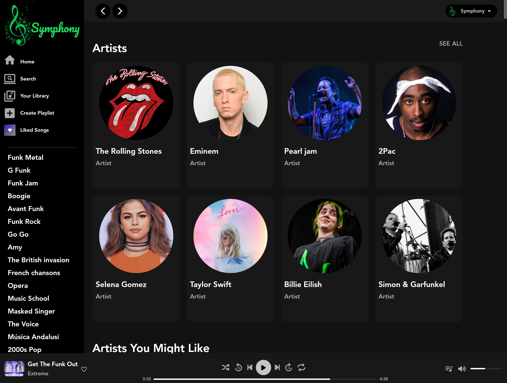
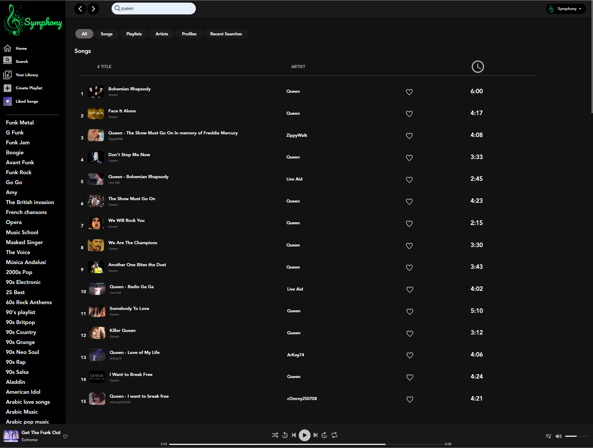
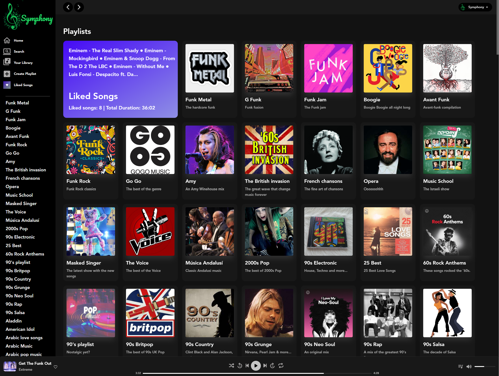
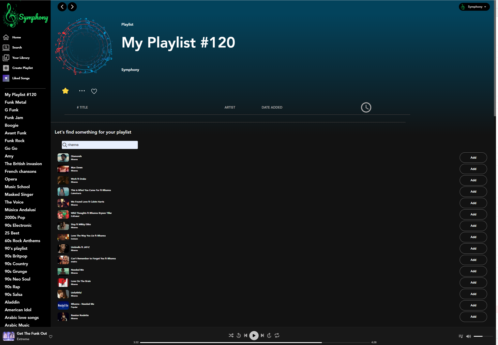
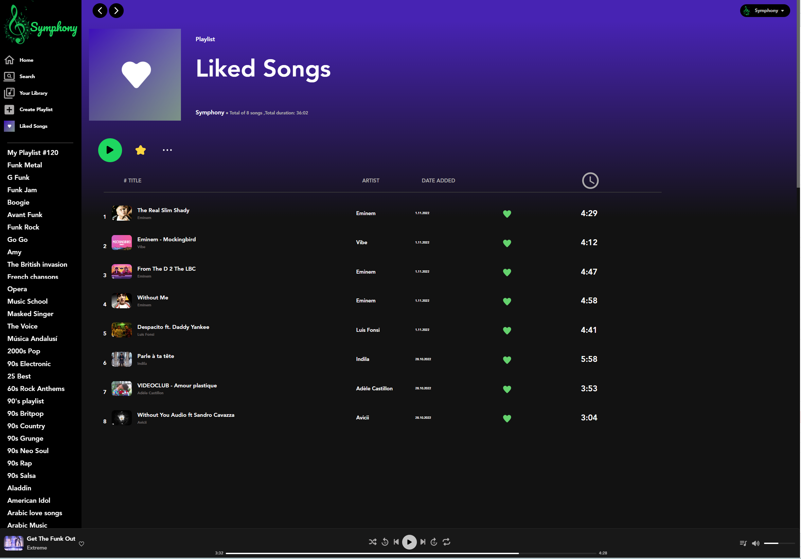
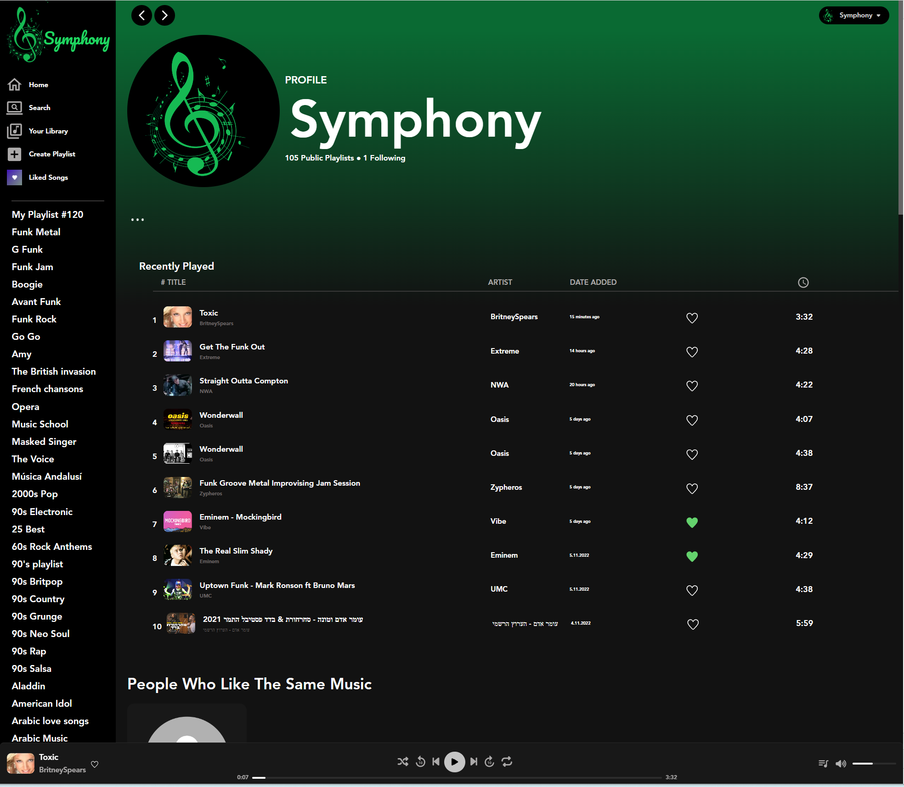
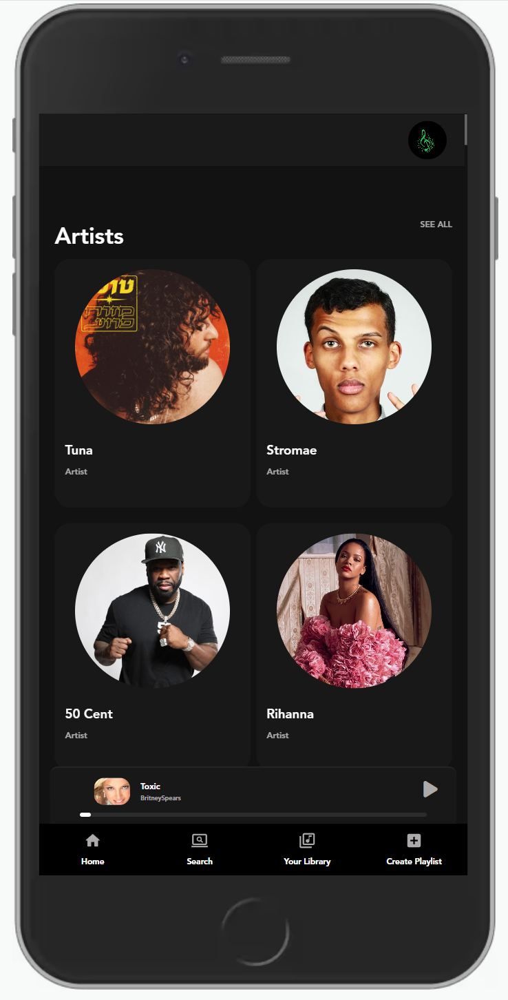
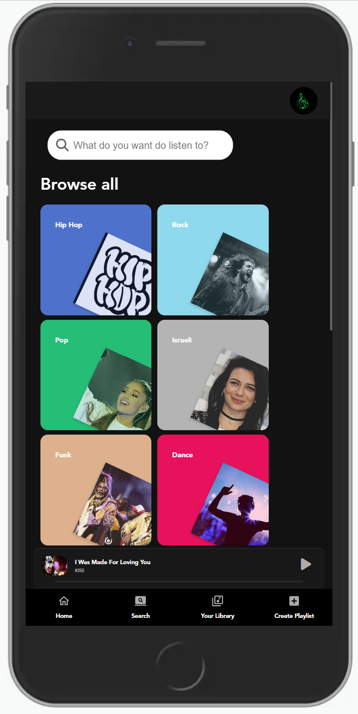
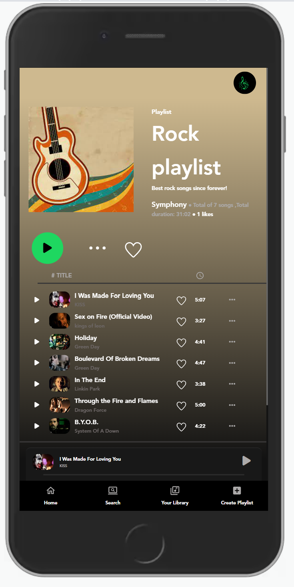
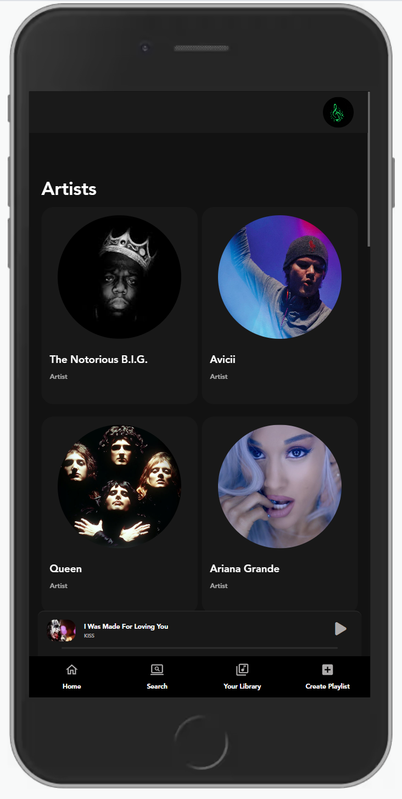

<h1 align="center"> Symphony - An awesome Spotify clone </h1>

<p> This application showcase how we can duplicate most of the functionality of Spotify within
a short amount of time using modern best practices and the power of React & Node.JS.<p>

 You can check it out [here ](https://symphony.onrender.com/).


[](http://www.youtube.com/watch?v=Gv7paA2OOFg)

### Table of Contents
- [Symphony Description](#symphony-description)
- [Application Features](#application-features)
- [Technologies](#technologies)
- [Getting started:](#getting-started)
- [Deployment](#deployment)
- [Showcase](#showcase)
- [Authors](#authors)

## Symphony Description
Symphony is a multilayered music app. With it's search engine and music player Symphony serves the need of the singular music lover.
You can like a song,and he will be saved to your personal library under the saved playlist "Liked Songs". You can also create you own playlists, giving you the options to manage your love of music.
But that's not all, Symphony also serves as a musical social network. Once you liked a song, Symphony will look for other users who like the same music and showcase them to you, in your home page. You can follow those users and expand your musical horizons. Profiles will also be showcased in the search page, if their playlists includes the search term you were looking for.


## Application Features
- Play songs and playlist through our multifunctional media player. Switch songs, skip 10 seconds back and forward, set playback mode, set the timeline or volume, toggle mute and also go to the Queue page, were you can see the playlist that the media player is running.
- Search songs with the ***Youtube API***, play them instantly, like them, and they will be saved to your "Liked Songs" playlist, or save them to one of your personal playlists.
- Create your own playlist, you can add an image to your playlist, and Symphony will color the nackground of your playlist with the dominant color of that image,
creating a beautifull unique visual. You can edit the playlist name, description at any time. The background color will change with the image. You can add the playlist to your profile, and it will be showcase to other users viewing you profile. 
- Add songs to your playlist, remove them, and shuffle the order using ***DND*** that will be saved to your next entry.
- ***DND*** is applied throughout the appliction, in the side bar with the playlists list, and inside any playlist, you can use ***DND***, but it will only be saved if the user owns the playlist.
- You can view other users profiles, and follow them.
- Online updates using ***Web sockets***. So you can watch other users updating their profile or playlists.
- Symphony has ***PWA*** support, and you can download the app to your mobile device or you personal computer.
 
## Technologies
- MongoDB
- Express
- Node.js
- Rest API
- React
- Sass
- Many third party libraries like: **React Youtube**, **Beautifull DND**, and more.
    
## Getting started:

* Clone the repository
* Run the following commands to run the backend:

Update the `backend/config/dev.js` file to a valid MongoDB url (we don't store secrets in the repository).
By default, we use MongoDB on `localhost` and with no authentication.

    $ cd backend
    $ npm i
    $ npm run dev

* Run the following commands to run the frontend:

```
$ cd frontend
$ npm i
$ npm start
```

## Deployment

In the `frontend` diretory, execute: `npm run build`

Copy the `build` directory to the backend's `public` diretory and push that to your production server.

Remember, for production usage, you need to update the `backend/config/prod.js` and set the production
values for `dbUrl` (MongoDB connection string) and `secretKey` (which is used as the encryption key for
encrypted cookies).

## Showcase

### Homepage
The landing page in which the user can view the Artist profiles and Playlists made by the Symphony team.


### Search page
The search page, where you can search songs across the web, and across the profiles and playlist in the Symphony data base.



### Library
The library page contains previews and links, to the user Liked Songs playlist, and all his personal playlists.



### Create a Playlist
Personal playlist page, where the user can change the image, playlist name and description. Add and remove songs.



### Liked Songs
The Liked Songs page. When a user likes a song, the songs is saved to this playlist. The user can remove the songs by disliking the song.



### Profile Page
The profile page contains the user public playlists, followers and followed profiled lists. In the personal profile page, recently played songs are shown, with a profile list of users who like the same music.



### Some mobile!
Just a taste of the mobile experience. We used different **mixins**, **conditional rendering**, and the **"mobile first"** approach. 



### Authors
 - [Eshel Eyni](https://github.com/EshelEyni)
 - [Alexander Hlebnikov](https://github.com/Alexorcizet)
 - [Daria Marchashov](https://github.com/Dariamarh)
